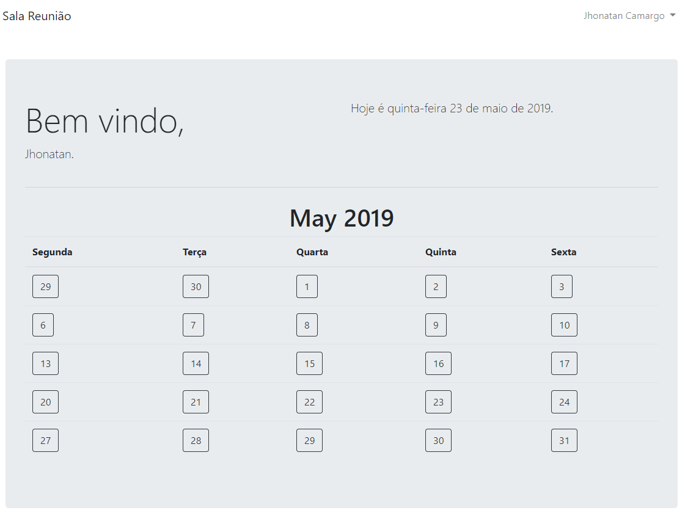

# Nota

Sistema simples para gerenciamento de reservas com Testes Unitários

# Instalação

- No terminal, dentro da pasta principal, digite: php artisan serve;
- Logo após, crie o banco de dados com o nome salareuniao;
- Abra um novo terminal e execute o comando php artisan migrate;
- Registre um novo usuário.

# Testes Unitários
- Para execução de testes, digite: .vendor\bin\phpunit, na pasta principal.

Tecnologias utilizadas: PHP 7, Laravel, Bootstrap, jQuery, HTML5, CSS3, MySQL

# Autor:
- Jhonatan Lopes
